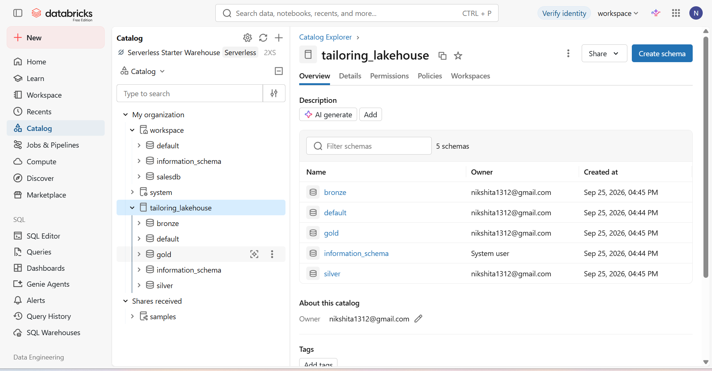
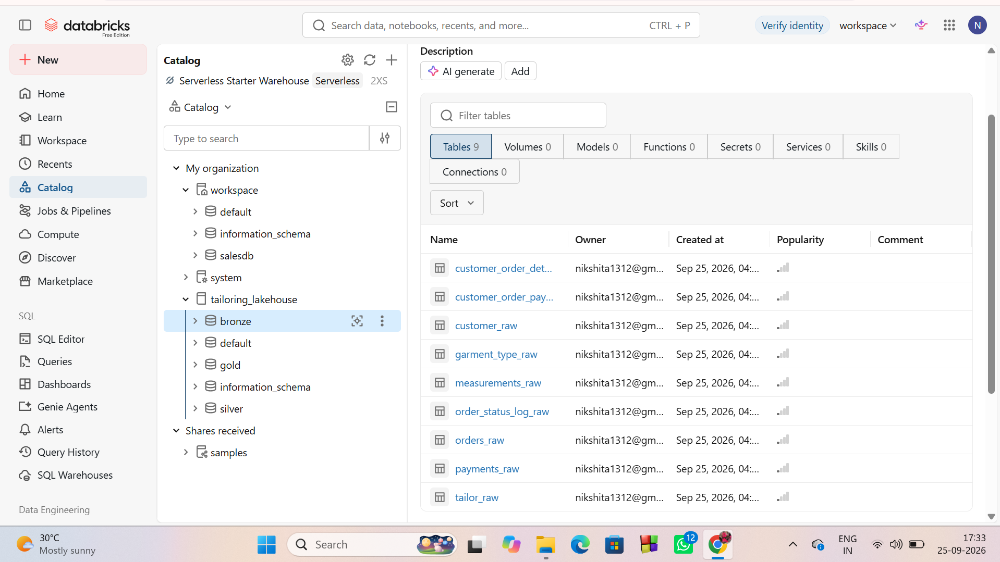
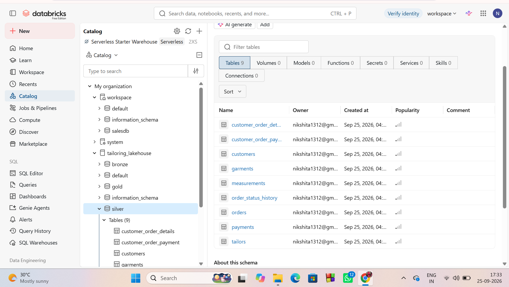
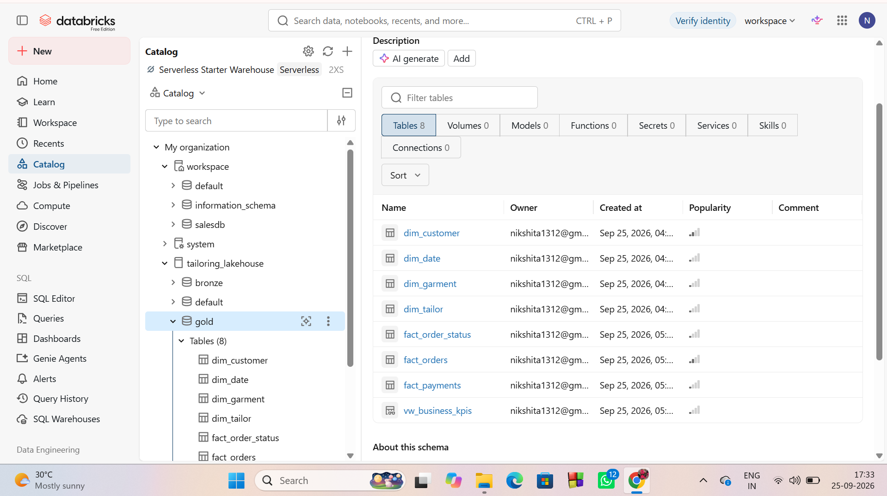

# Tailoring Business Intelligence  & SQL Analytics — Databricks

## 📌 Project Overview

This project demonstrates the design and implementation of a **Lakehouse-based Data Engineering and Business Intelligence solution** for a tailoring business.

The original operational data was designed in MySQL and includes information about:

- Customers
- Tailors
- Garments
- Customer measurements
- Orders
- Payments
- Order status history

The project modernizes the source data into a **Databricks Medallion Architecture** using **Delta Lakehouse**, followed by dimensional modeling and SQL-based business analytics.

### Data Pipeline

**Data Creation → Bronze → Silver → Gold → Analytics**

---

## 🏗️ Architecture

```text
                 MySQL / Source Data
                         │
                         ▼
                ┌─────────────────┐
                │     BRONZE      │
                │   Raw Delta     │
                │     Tables      │
                └────────┬────────┘
                         │
                  Data Cleaning
                  Type Conversion
                  Standardization
                         │
                         ▼
                ┌─────────────────┐
                │     SILVER      │
                │ Cleaned Delta   │
                │     Tables      │
                └────────┬────────┘
                         │
                 Dimensional Modeling
                         │
                         ▼
                ┌─────────────────┐
                │      GOLD       │
                │ Data Warehouse  │
                │ Fact + Dimension│
                └────────┬────────┘
                         │
                         ▼
                Databricks SQL
                    Analytics

## ⭐ Databricks Lakehouse Catalog



## 🥉 Bronze Layer



## 🥈 Silver Layer



## 🥇 Gold Layer

t-SQL-Data-Warehouse/blob/main/Databricks/files/screenshots/Gold-layer-tables.png))
